# STRATOS – Logistics Decision Support Platform

An end-to-end logistics analytics platform that enables data-driven operational decision making through shipment analytics, spatial intelligence, machine learning, sustainability metrics, and disruption simulation.

> Built using **Python, Streamlit, GeoPandas, Folium, Scikit-learn, Plotly, and Pandas**

---

# Dashboard Preview

## Home Dashboard

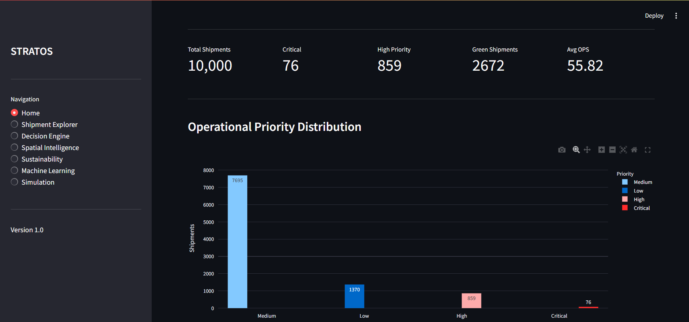

---

## Shipment Explorer

| Overview | Detailed Analytics |
|----------|--------------------|
| 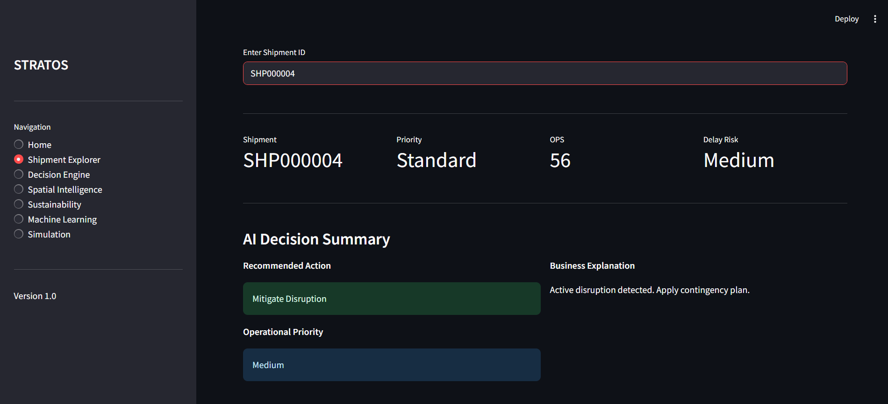 | 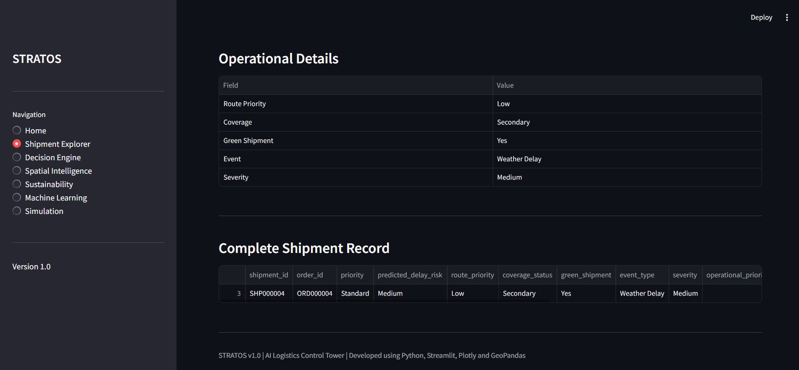 |

---

## Decision Engine

| Operational Insights | Recommendation Engine |
|----------------------|-----------------------|
| 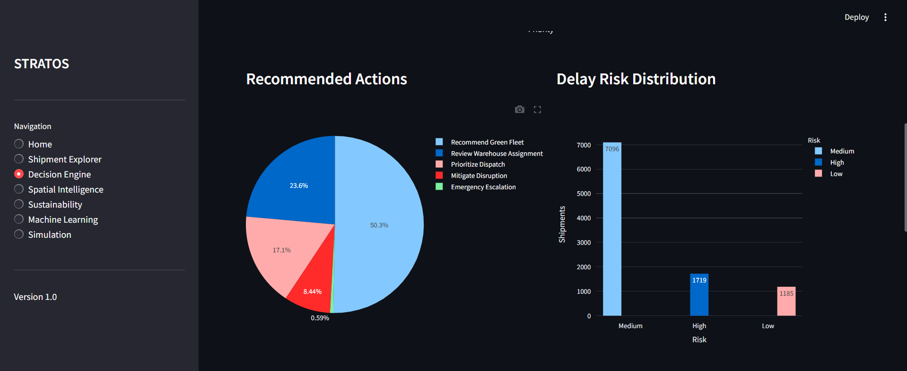 | 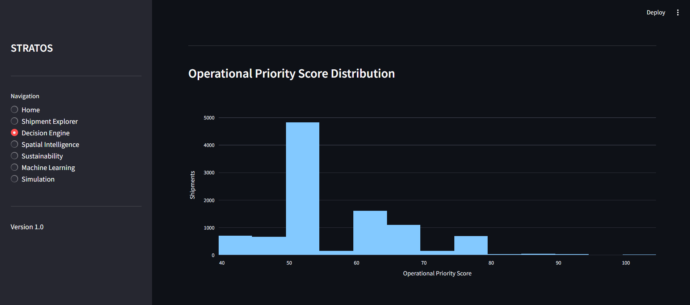 |

---

## Spatial Intelligence

| Warehouse Coverage | Interactive Logistics Map |
|--------------------|---------------------------|
| 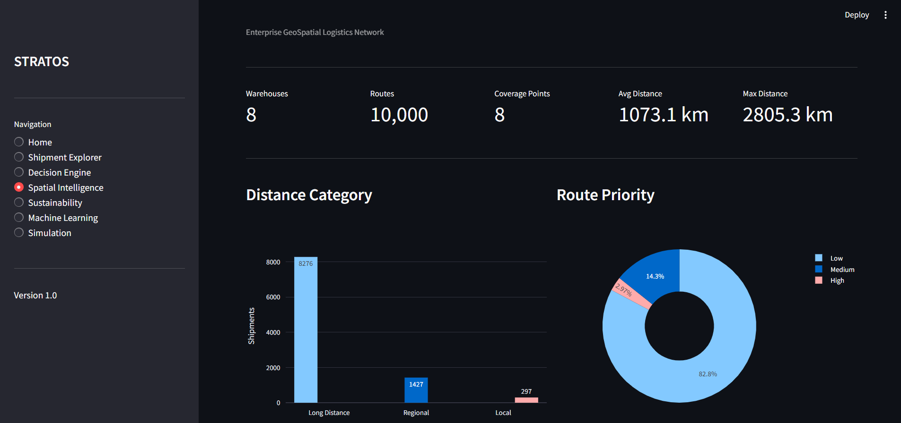 | 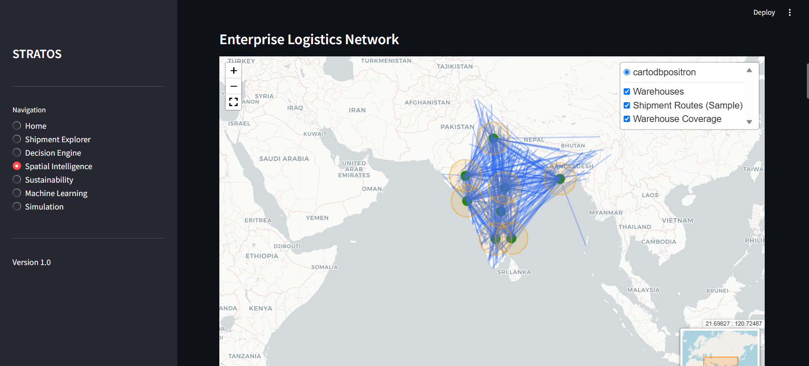 |

---

## Sustainability Analytics

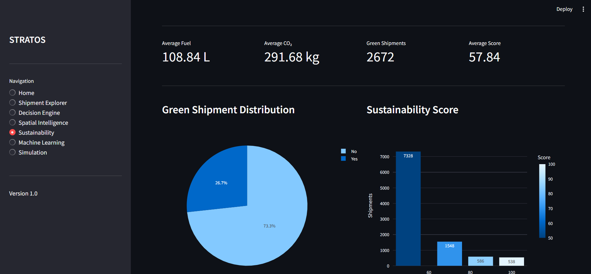

---

## Machine Learning

| Model Performance | Feature Analysis |
|-------------------|------------------|
| 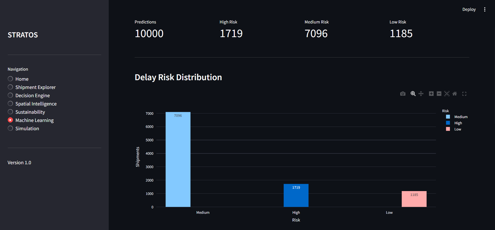 | 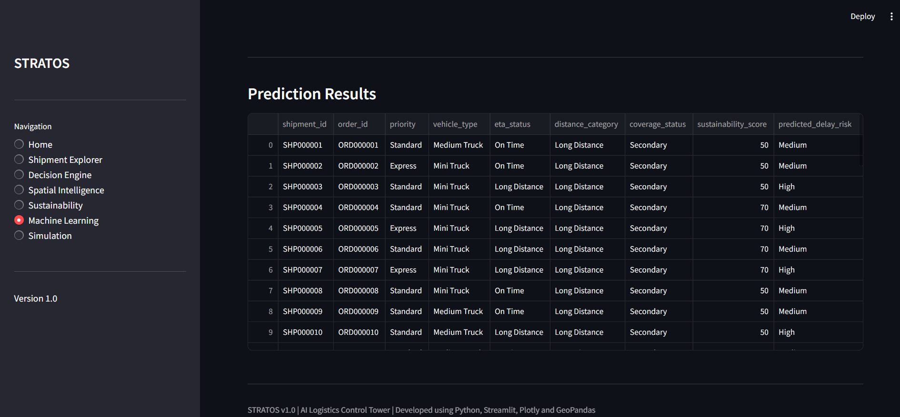 |

---

## Simulation

| Simulation Overview | Scenario Analysis |
|---------------------|-------------------|
| 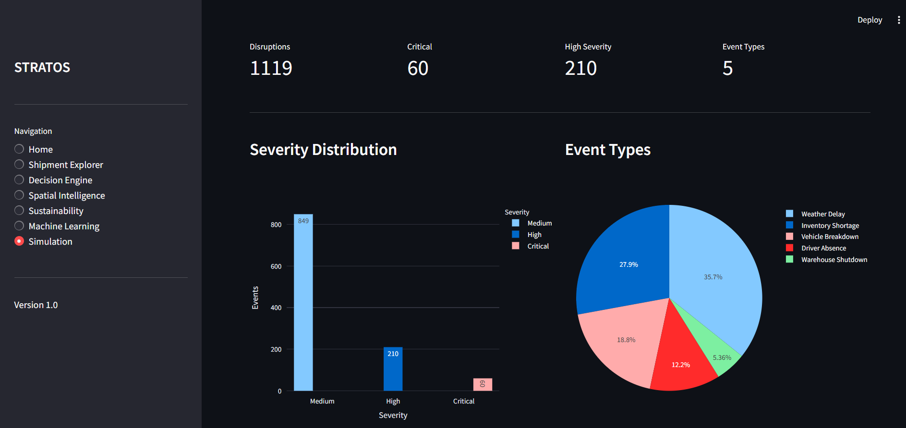 | 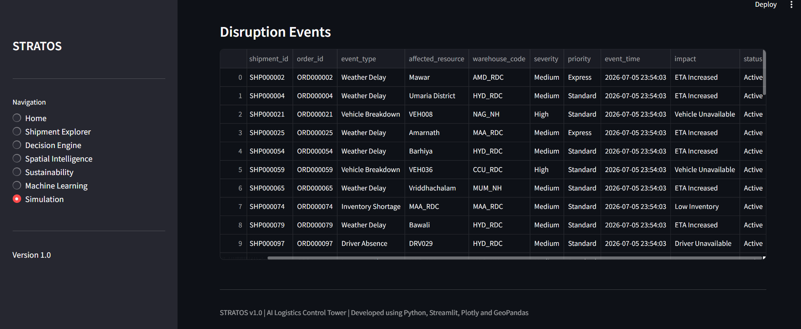 |
---

# Project Overview

Modern logistics operations generate large volumes of shipment data across multiple locations and transportation networks. Organizations often struggle to convert this data into actionable operational insights.

STRATOS addresses this challenge by integrating logistics analytics, spatial visualization, predictive machine learning, sustainability analysis, and disruption simulation into a unified decision support platform.

The platform enables logistics managers and analysts to monitor operational performance, identify risks, analyze shipment trends, evaluate warehouse coverage, predict delivery delays, and simulate disruption scenarios through an interactive dashboard.

---

# Business Objectives

- Improve logistics visibility
- Monitor shipment performance
- Predict delivery delays
- Support operational decision making
- Analyze warehouse coverage geographically
- Track sustainability metrics
- Simulate supply chain disruptions

---

# Key Features

### Executive Dashboard

- Logistics KPIs
- Shipment statistics
- Operational overview

### Shipment Explorer

- Interactive shipment filtering
- Delivery status analysis
- Route exploration

### Decision Engine

- Operational recommendations
- Delay prioritization
- Business rule-based insights

### Spatial Intelligence

- Warehouse visualization
- Route mapping
- Geographic coverage analysis

### Sustainability Analytics

- Carbon emission metrics
- Sustainability KPIs
- Environmental performance insights

### Machine Learning

- Shipment delay prediction
- Feature importance analysis
- Model performance evaluation

### Disruption Simulation

- Supply chain disruption scenarios
- Operational impact assessment
- Risk visualization

---

# System Architecture

```
                Raw Logistics Data
                        │
                        ▼
               Data Preprocessing
                        │
                        ▼
             Feature Engineering
                        │
        ┌───────────────┼───────────────┐
        ▼               ▼               ▼
Decision Engine   Spatial Analytics   ML Pipeline
        │               │               │
        └───────────────┼───────────────┘
                        ▼
              Interactive Dashboard
```

---

# Technology Stack

| Category | Technologies |
|----------|--------------|
| Programming | Python |
| Dashboard | Streamlit |
| Data Analysis | Pandas, NumPy |
| Machine Learning | Scikit-learn |
| Spatial Analytics | GeoPandas, Folium |
| Visualization | Plotly |
| GIS Data | GeoJSON |
| Version Control | Git, GitHub |

---

# Machine Learning Pipeline

- Data preprocessing
- Feature engineering
- Model training
- Prediction generation
- Performance evaluation
- Interactive visualization

---

# Spatial Intelligence

The platform integrates geospatial analytics using GeoPandas and Folium to provide location-based logistics insights.

Features include:

- Warehouse locations
- Shipment routes
- Geographic coverage
- Interactive logistics maps

---

# Project Structure

```
STRATOS
│
├── data/
├── docs/
│   └── screenshots/
├── ml/
├── models/
├── notebooks/
├── spatial/
├── streamlit/
├── requirements.txt
├── README.md
└── app.py
```

---

# Installation

Clone the repository

```bash
git clone https://github.com/ad-singh10/STRATOS-Logistics-Decision-Support-Platform.git
```

Navigate into the project

```bash
cd STRATOS-Logistics-Decision-Support-Platform
```

Install dependencies

```bash
pip install -r requirements.txt
```

Run the application

```bash
streamlit run streamlit/app.py
```

---

# Future Enhancements

- Live GPS integration
- Traffic API integration
- Route optimization
- Demand forecasting
- Multi-modal transportation support
- Real-time shipment monitoring

---

# Learning Outcomes

Through this project, I gained practical experience in:

- Logistics analytics
- Geospatial data analysis
- Machine learning workflows
- Interactive dashboard development
- Data visualization
- Business KPI design
- End-to-end Python project development

---

# Author

**Aditya Singh**

Engineering & Computational Mechanics  
National Institute of Technology Jamshedpur

GitHub: https://github.com/ad-singh10

---

# License

This project is intended for educational and portfolio purposes.